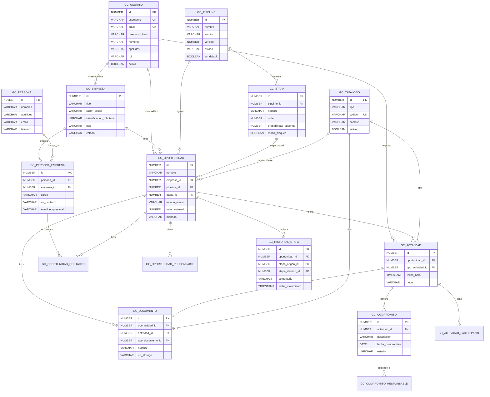

# B-01: Modelo Lógico de Datos
## Plataforma de Gestión Comercial - Arquitecsoft v0.1

**Fecha:** Febrero 2026  
**Versión:** 1.0  
**Clasificación:** Confidencial

---

## 1. Entidades Principales

### 1.1 GC_USUARIO (Administración de Usuarios)

| Campo | Tipo Lógico | Obligatorio | Descripción |
|-------|-------------|-------------|-------------|
| id | NUMBER | PK | Identificador único |
| username | VARCHAR(50) | Sí, Único | Nombre de usuario para login |
| email | VARCHAR(100) | Sí, Único | Correo electrónico |
| password_hash | VARCHAR(255) | Sí | Hash de contraseña |
| nombres | VARCHAR(100) | Sí | Nombres del usuario |
| apellidos | VARCHAR(100) | Sí | Apellidos del usuario |
| rol | VARCHAR(20) | Sí | ADMIN / COMERCIAL / LECTURA_KPI |
| activo | BOOLEAN | Sí | Estado del usuario |
| fecha_creacion | TIMESTAMP | Sí | Fecha de registro |
| fecha_modificacion | TIMESTAMP | No | Última modificación |

**Notas:**
- Entidad nueva (resuelta en T-00, A-04)
- RBAC mínimo: Admin, Comercial, Lectura-KPI

---

### 1.2 GC_EMPRESA

| Campo | Tipo Lógico | Obligatorio | Descripción |
|-------|-------------|-------------|-------------|
| id | NUMBER | PK | Identificador único |
| tipo | VARCHAR(20) | Sí | EMPRESA / MULTINACIONAL / ALIADO |
| razon_social | VARCHAR(200) | Sí | Razón social o nombre |
| identificacion_tributaria | VARCHAR(50) | No | NIT, RUC, etc. |
| sitio_web | VARCHAR(200) | No | URL del sitio web |
| pais | VARCHAR(100) | No | País de origen |
| estado | VARCHAR(20) | Sí | ACTIVA / INACTIVA |
| fecha_creacion | TIMESTAMP | Sí | Fecha de registro |
| fecha_modificacion | TIMESTAMP | No | Última modificación |
| creado_por | NUMBER | Sí | FK → GC_USUARIO |
| modificado_por | NUMBER | No | FK → GC_USUARIO |

**Reglas:**
- Una empresa puede ser prospecto, cliente o aliado (campo tipo)
- Estado por defecto: ACTIVA

---

### 1.3 GC_PERSONA

| Campo | Tipo Lógico | Obligatorio | Descripción |
|-------|-------------|-------------|-------------|
| id | NUMBER | PK | Identificador único |
| nombres | VARCHAR(100) | Sí | Nombres |
| apellidos | VARCHAR(100) | Sí | Apellidos |
| email | VARCHAR(100) | No | Correo electrónico personal |
| telefono | VARCHAR(30) | No | Teléfono personal |
| activo | BOOLEAN | Sí | Estado de la persona |
| fecha_creacion | TIMESTAMP | Sí | Fecha de registro |
| fecha_modificacion | TIMESTAMP | No | Última modificación |
| creado_por | NUMBER | Sí | FK → GC_USUARIO |
| modificado_por | NUMBER | No | FK → GC_USUARIO |

**Notas:**
- Persona puede relacionarse con múltiples empresas
- Email y teléfono aquí son personales; los de contexto empresarial van en la relación

---

### 1.4 GC_PERSONA_EMPRESA (Tabla Intermedia N:M)

| Campo | Tipo Lógico | Obligatorio | Descripción |
|-------|-------------|-------------|-------------|
| id | NUMBER | PK | Identificador único |
| persona_id | NUMBER | FK, Sí | FK → GC_PERSONA |
| empresa_id | NUMBER | FK, Sí | FK → GC_EMPRESA |
| cargo | VARCHAR(100) | No | Cargo en la empresa |
| puesto | VARCHAR(100) | No | Puesto/Área |
| rol_contacto | VARCHAR(50) | No | DECISOR / INFLUENCIADOR / TECNICO / USUARIO |
| email_empresarial | VARCHAR(100) | No | Email en esta empresa |
| telefono_empresarial | VARCHAR(30) | No | Teléfono en esta empresa |
| es_contacto_principal | BOOLEAN | Sí | Indicador de contacto principal |
| activo | BOOLEAN | Sí | Relación activa |
| fecha_creacion | TIMESTAMP | Sí | Fecha de registro |
| fecha_modificacion | TIMESTAMP | No | Última modificación |

**Reglas:**
- Decisión confirmada T-00: incluye cargo, teléfono, email, rol, puesto
- Una persona puede tener diferentes cargos en diferentes empresas
- Constraint único: (persona_id, empresa_id)

---

### 1.5 GC_PIPELINE

| Campo | Tipo Lógico | Obligatorio | Descripción |
|-------|-------------|-------------|-------------|
| id | NUMBER | PK | Identificador único |
| nombre | VARCHAR(100) | Sí | Nombre del pipeline |
| ambito | VARCHAR(50) | Sí | GESTION_COMERCIAL (extensible) |
| version | NUMBER | Sí | Versión del pipeline |
| estado | VARCHAR(20) | Sí | ACTIVO / INACTIVO |
| es_default | BOOLEAN | Sí | Pipeline por defecto para nuevas oportunidades |
| fecha_creacion | TIMESTAMP | Sí | Fecha de registro |
| fecha_modificacion | TIMESTAMP | No | Última modificación |
| creado_por | NUMBER | Sí | FK → GC_USUARIO |
| modificado_por | NUMBER | No | FK → GC_USUARIO |

**Reglas:**
- RB-02: Pipelines configurables sin límite
- Solo un pipeline puede ser default por ámbito

---

### 1.6 GC_ETAPA

| Campo | Tipo Lógico | Obligatorio | Descripción |
|-------|-------------|-------------|-------------|
| id | NUMBER | PK | Identificador único |
| pipeline_id | NUMBER | FK, Sí | FK → GC_PIPELINE |
| nombre | VARCHAR(100) | Sí | Nombre de la etapa |
| orden | NUMBER | Sí | Posición en el pipeline |
| probabilidad_sugerida | NUMBER(3) | No | 0-100, probabilidad default |
| color | VARCHAR(7) | No | Color hex para UI (#RRGGBB) |
| modo_bloqueo | BOOLEAN | Sí | Si requiere completar requisitos |
| estado | VARCHAR(20) | Sí | ACTIVA / INACTIVA |
| fecha_creacion | TIMESTAMP | Sí | Fecha de registro |
| fecha_modificacion | TIMESTAMP | No | Última modificación |

**Reglas:**
- RB-05: modo_bloqueo = FALSE por defecto (modo guía)
- Orden único dentro del mismo pipeline
- Constraint único: (pipeline_id, orden)

---

### 1.7 GC_OPORTUNIDAD

| Campo | Tipo Lógico | Obligatorio | Descripción |
|-------|-------------|-------------|-------------|
| id | NUMBER | PK | Identificador único |
| nombre | VARCHAR(200) | Sí | Nombre de la oportunidad |
| empresa_id | NUMBER | FK, Sí | FK → GC_EMPRESA |
| pipeline_id | NUMBER | FK, Sí | FK → GC_PIPELINE |
| etapa_id | NUMBER | FK, Sí | FK → GC_ETAPA (etapa actual) |
| estado_macro | VARCHAR(20) | Sí | ABIERTA / SEGUIMIENTO / GANADA / PERDIDA / NO_CONCRETADA |
| valor_estimado | NUMBER(15,2) | No | Valor monetario estimado |
| moneda | VARCHAR(3) | No | ISO 4217 (COP, USD, EUR) |
| probabilidad | NUMBER(3) | No | 0-100, puede diferir de etapa |
| fecha_estimada_cierre | DATE | No | Fecha esperada de cierre |
| fuente | VARCHAR(100) | No | Origen del lead |
| tipo_servicio | VARCHAR(100) | No | Tipo de servicio ofrecido |
| motivo_cierre_id | NUMBER | FK, No | FK → GC_CATALOGO (si cerrada) |
| comentario_cierre | VARCHAR(500) | No | Detalle del cierre |
| fecha_cierre | TIMESTAMP | No | Fecha real de cierre |
| fecha_creacion | TIMESTAMP | Sí | Fecha de registro |
| fecha_modificacion | TIMESTAMP | No | Última modificación |
| creado_por | NUMBER | Sí | FK → GC_USUARIO |
| modificado_por | NUMBER | No | FK → GC_USUARIO |

**Reglas:**
- RB-01: Una oportunidad → 1 pipeline, 1 etapa activa
- RB-04: motivo_cierre obligatorio si estado = PERDIDA o NO_CONCRETADA
- Pipeline no puede cambiar después de creación
- estado_macro inicial: ABIERTA

---

### 1.8 GC_OPORTUNIDAD_RESPONSABLE (Tabla Intermedia N:M)

| Campo | Tipo Lógico | Obligatorio | Descripción |
|-------|-------------|-------------|-------------|
| id | NUMBER | PK | Identificador único |
| oportunidad_id | NUMBER | FK, Sí | FK → GC_OPORTUNIDAD |
| tipo_responsable | VARCHAR(20) | Sí | USUARIO / PERSONA_EXTERNA |
| usuario_id | NUMBER | FK, No | FK → GC_USUARIO (si interno) |
| persona_id | NUMBER | FK, No | FK → GC_PERSONA (si externo) |
| rol | VARCHAR(50) | Sí | PRINCIPAL / APOYO / TECNICO |
| activo | BOOLEAN | Sí | Responsabilidad activa |
| fecha_asignacion | TIMESTAMP | Sí | Fecha de asignación |

**Reglas:**
- Decisión T-00: Responsable puede ser interno, externo o ambos
- Al menos un responsable PRINCIPAL por oportunidad
- usuario_id XOR persona_id (uno u otro, no ambos)

---

### 1.9 GC_OPORTUNIDAD_CONTACTO (Tabla Intermedia N:M)

| Campo | Tipo Lógico | Obligatorio | Descripción |
|-------|-------------|-------------|-------------|
| id | NUMBER | PK | Identificador único |
| oportunidad_id | NUMBER | FK, Sí | FK → GC_OPORTUNIDAD |
| persona_empresa_id | NUMBER | FK, Sí | FK → GC_PERSONA_EMPRESA |
| es_contacto_principal | BOOLEAN | Sí | Contacto principal de la oportunidad |
| fecha_asignacion | TIMESTAMP | Sí | Fecha de asignación |

**Reglas:**
- Resuelve A-05: Una oportunidad puede tener múltiples contactos
- Contacto viene de la relación persona-empresa (contexto)

---

### 1.10 GC_ACTIVIDAD

| Campo | Tipo Lógico | Obligatorio | Descripción |
|-------|-------------|-------------|-------------|
| id | NUMBER | PK | Identificador único |
| oportunidad_id | NUMBER | FK, Sí | FK → GC_OPORTUNIDAD |
| tipo_actividad_id | NUMBER | FK, Sí | FK → GC_CATALOGO |
| fecha_hora | TIMESTAMP | Sí | Fecha y hora de la actividad |
| duracion_minutos | NUMBER | No | Duración en minutos |
| notas | VARCHAR(2000) | No | Notas de la actividad |
| fecha_creacion | TIMESTAMP | Sí | Fecha de registro |
| creado_por | NUMBER | Sí | FK → GC_USUARIO |

**Reglas:**
- Actividad siempre asociada a una oportunidad
- Tipo viene de catálogo

---

### 1.11 GC_ACTIVIDAD_PARTICIPANTE (Tabla Intermedia N:M)

| Campo | Tipo Lógico | Obligatorio | Descripción |
|-------|-------------|-------------|-------------|
| id | NUMBER | PK | Identificador único |
| actividad_id | NUMBER | FK, Sí | FK → GC_ACTIVIDAD |
| tipo_participante | VARCHAR(20) | Sí | USUARIO / PERSONA_EXTERNA |
| usuario_id | NUMBER | FK, No | FK → GC_USUARIO |
| persona_id | NUMBER | FK, No | FK → GC_PERSONA |

**Notas:**
- Permite registrar quiénes participaron en la actividad

---

### 1.12 GC_COMPROMISO

| Campo | Tipo Lógico | Obligatorio | Descripción |
|-------|-------------|-------------|-------------|
| id | NUMBER | PK | Identificador único |
| actividad_id | NUMBER | FK, Sí | FK → GC_ACTIVIDAD |
| descripcion | VARCHAR(500) | Sí | Descripción del compromiso |
| fecha_compromiso | DATE | Sí | Fecha límite |
| estado | VARCHAR(20) | Sí | PENDIENTE / EN_PROGRESO / COMPLETADO / CANCELADO |
| fecha_completado | TIMESTAMP | No | Fecha real de cumplimiento |
| notas_cierre | VARCHAR(500) | No | Notas al completar |
| fecha_creacion | TIMESTAMP | Sí | Fecha de registro |
| fecha_modificacion | TIMESTAMP | No | Última modificación |
| creado_por | NUMBER | Sí | FK → GC_USUARIO |

---

### 1.13 GC_COMPROMISO_RESPONSABLE (Tabla Intermedia N:M)

| Campo | Tipo Lógico | Obligatorio | Descripción |
|-------|-------------|-------------|-------------|
| id | NUMBER | PK | Identificador único |
| compromiso_id | NUMBER | FK, Sí | FK → GC_COMPROMISO |
| tipo_responsable | VARCHAR(20) | Sí | USUARIO / PERSONA_EXTERNA |
| usuario_id | NUMBER | FK, No | FK → GC_USUARIO |
| persona_id | NUMBER | FK, No | FK → GC_PERSONA |

**Reglas:**
- Decisión T-00: Responsable puede ser interno o externo

---

### 1.14 GC_DOCUMENTO

| Campo | Tipo Lógico | Obligatorio | Descripción |
|-------|-------------|-------------|-------------|
| id | NUMBER | PK | Identificador único |
| oportunidad_id | NUMBER | FK, No | FK → GC_OPORTUNIDAD |
| actividad_id | NUMBER | FK, No | FK → GC_ACTIVIDAD |
| tipo_documento_id | NUMBER | FK, Sí | FK → GC_CATALOGO |
| nombre | VARCHAR(200) | Sí | Nombre del archivo |
| nombre_original | VARCHAR(200) | Sí | Nombre original subido |
| extension | VARCHAR(10) | Sí | Extensión del archivo |
| tamano_bytes | NUMBER | Sí | Tamaño en bytes |
| url_storage | VARCHAR(500) | Sí | Ubicación en OCI Object Storage |
| bucket_name | VARCHAR(100) | Sí | Nombre del bucket |
| object_key | VARCHAR(200) | Sí | Key del objeto en storage |
| fecha_carga | TIMESTAMP | Sí | Fecha de carga |
| cargado_por | NUMBER | Sí | FK → GC_USUARIO |

**Reglas:**
- BE-005: Solo metadatos en BD, archivo en OCI Storage
- Debe tener oportunidad_id O actividad_id (al menos uno)

---

### 1.15 GC_HISTORIAL_ETAPA (Auditoría de Movimientos)

| Campo | Tipo Lógico | Obligatorio | Descripción |
|-------|-------------|-------------|-------------|
| id | NUMBER | PK | Identificador único |
| oportunidad_id | NUMBER | FK, Sí | FK → GC_OPORTUNIDAD |
| etapa_origen_id | NUMBER | FK, No | FK → GC_ETAPA (null si es creación) |
| etapa_destino_id | NUMBER | FK, Sí | FK → GC_ETAPA |
| estado_macro_origen | VARCHAR(20) | No | Estado anterior |
| estado_macro_destino | VARCHAR(20) | Sí | Estado nuevo |
| comentario | VARCHAR(500) | No | Motivo del movimiento |
| fecha_movimiento | TIMESTAMP | Sí | Fecha del cambio |
| realizado_por | NUMBER | Sí | FK → GC_USUARIO |

**Reglas:**
- RB-03: Auditoría completa de movimientos
- Se crea registro en cada cambio de etapa o estado

---

### 1.16 GC_CATALOGO (Catálogos Configurables)

| Campo | Tipo Lógico | Obligatorio | Descripción |
|-------|-------------|-------------|-------------|
| id | NUMBER | PK | Identificador único |
| tipo | VARCHAR(50) | Sí | TIPO_ACTIVIDAD / TIPO_DOCUMENTO / MOTIVO_CIERRE / MONEDA |
| codigo | VARCHAR(50) | Sí | Código único dentro del tipo |
| nombre | VARCHAR(100) | Sí | Nombre para mostrar |
| descripcion | VARCHAR(200) | No | Descripción adicional |
| orden | NUMBER | No | Orden de presentación |
| activo | BOOLEAN | Sí | Si está disponible |
| fecha_creacion | TIMESTAMP | Sí | Fecha de registro |

**Reglas:**
- Constraint único: (tipo, codigo)
- Centraliza todos los catálogos del sistema

---

### 1.17 GC_AUDITORIA_EVENTO (Log General)

| Campo | Tipo Lógico | Obligatorio | Descripción |
|-------|-------------|-------------|-------------|
| id | NUMBER | PK | Identificador único |
| entidad | VARCHAR(50) | Sí | Nombre de la tabla afectada |
| entidad_id | NUMBER | Sí | ID del registro afectado |
| accion | VARCHAR(20) | Sí | CREATE / UPDATE / DELETE |
| datos_anteriores | CLOB | No | JSON con valores anteriores |
| datos_nuevos | CLOB | No | JSON con valores nuevos |
| usuario_id | NUMBER | FK, Sí | FK → GC_USUARIO |
| ip_address | VARCHAR(50) | No | IP del cliente |
| fecha_evento | TIMESTAMP | Sí | Fecha del evento |

**Reglas:**
- BE-003: Auditoría obligatoria
- Complementa GC_HISTORIAL_ETAPA para auditoría general

---

## 2. Catálogos Predefinidos

### 2.1 TIPO_ACTIVIDAD

| Código | Nombre |
|--------|--------|
| REUNION | Reunión |
| LLAMADA | Llamada |
| VISITA | Visita |
| DEMO | Demo |
| PRESENTACION | Presentación |
| ENVIO_PROPUESTA | Envío de propuesta |
| SEGUIMIENTO | Seguimiento |

### 2.2 TIPO_DOCUMENTO

| Código | Nombre |
|--------|--------|
| PROPUESTA | Propuesta |
| ESTIMACION | Estimación económica |
| RFP | RFP |
| ACTA | Acta |
| COTIZACION | Cotización |
| CONTRATO_BORRADOR | Contrato borrador |
| ORDEN_COMPRA | Orden de compra/servicio |
| OTROS | Otros |

### 2.3 MOTIVO_CIERRE

| Código | Nombre |
|--------|--------|
| PRECIO | Precio |
| COMPETENCIA | Competencia |
| SIN_PRESUPUESTO | Sin presupuesto |
| ALCANCE_NO_ALINEADO | Alcance no alineado |
| CLIENTE_DESISTIO | Cliente desistió |
| NO_RESPUESTA | No respuesta |
| OTRO | Otro |

### 2.4 MONEDA

| Código | Nombre |
|--------|--------|
| COP | Peso Colombiano |
| USD | Dólar Estadounidense |
| EUR | Euro |

---

## 3. Relaciones y Cardinalidades

### 3.1 Diagrama de Relaciones

```
┌─────────────┐       ┌─────────────────┐       ┌─────────────┐
│ GC_USUARIO  │       │  GC_EMPRESA     │       │ GC_PERSONA  │
└──────┬──────┘       └────────┬────────┘       └──────┬──────┘
       │                       │                       │
       │              ┌────────┴────────┐              │
       │              │                 │              │
       │              ▼                 │              │
       │    ┌─────────────────┐        │              │
       │    │GC_PERSONA_EMPRESA│◄───────┼──────────────┘
       │    └────────┬────────┘        │         N:M
       │             │                 │
       │             ▼                 │
       │    ┌─────────────────┐        │
       │    │GC_OPORTUNIDAD_  │        │
       │    │   CONTACTO      │        │
       │    └────────┬────────┘        │
       │             │                 │
       │             ▼                 │
       │    ┌─────────────────┐        │
       └───►│ GC_OPORTUNIDAD  │◄───────┘
            └────────┬────────┘
                     │
       ┌─────────────┼─────────────┬────────────────┐
       │             │             │                │
       ▼             ▼             ▼                ▼
┌──────────┐  ┌──────────┐  ┌───────────┐   ┌─────────────┐
│GC_OPOR_  │  │GC_ACTIV  │  │GC_DOCUMEN │   │GC_HISTORIAL │
│RESPONSAB │  │IDAD      │  │TO         │   │_ETAPA       │
└──────────┘  └────┬─────┘  └───────────┘   └─────────────┘
                   │
         ┌─────────┼─────────┐
         │         │         │
         ▼         ▼         ▼
   ┌──────────┐ ┌────────┐ ┌───────────┐
   │GC_ACTIV_ │ │GC_COMP │ │GC_DOCUMEN │
   │PARTICIP  │ │ROMISO  │ │TO         │
   └──────────┘ └───┬────┘ └───────────┘
                    │
                    ▼
              ┌───────────┐
              │GC_COMPROM │
              │_RESPONSAB │
              └───────────┘
```

### 3.2 Tabla de Cardinalidades

| Relación | Cardinalidad | Descripción |
|----------|--------------|-------------|
| USUARIO → EMPRESA | 1:N | Usuario crea/modifica empresas |
| USUARIO → OPORTUNIDAD | 1:N | Usuario crea/modifica oportunidades |
| EMPRESA → OPORTUNIDAD | 1:N | Una empresa tiene muchas oportunidades |
| EMPRESA ↔ PERSONA | N:M | Personas trabajan en múltiples empresas |
| OPORTUNIDAD → PIPELINE | N:1 | Muchas oportunidades en un pipeline |
| OPORTUNIDAD → ETAPA | N:1 | Muchas oportunidades en una etapa |
| PIPELINE → ETAPA | 1:N | Un pipeline tiene muchas etapas |
| OPORTUNIDAD ↔ USUARIO/PERSONA | N:M | Múltiples responsables |
| OPORTUNIDAD ↔ PERSONA_EMPRESA | N:M | Múltiples contactos |
| OPORTUNIDAD → ACTIVIDAD | 1:N | Una oportunidad tiene muchas actividades |
| OPORTUNIDAD → DOCUMENTO | 1:N | Una oportunidad tiene muchos documentos |
| OPORTUNIDAD → HISTORIAL_ETAPA | 1:N | Historial de movimientos |
| ACTIVIDAD → COMPROMISO | 1:N | Una actividad genera compromisos |
| ACTIVIDAD → DOCUMENTO | 1:N | Una actividad puede tener documentos |
| ACTIVIDAD ↔ USUARIO/PERSONA | N:M | Múltiples participantes |
| COMPROMISO ↔ USUARIO/PERSONA | N:M | Múltiples responsables |
| CATALOGO → ACTIVIDAD | 1:N | Tipo de actividad |
| CATALOGO → DOCUMENTO | 1:N | Tipo de documento |
| CATALOGO → OPORTUNIDAD | 1:N | Motivo de cierre |

---

## 4. Identificación de Tablas N:M

| # | Tabla Intermedia | Entidad A | Entidad B | Campos Adicionales |
|---|------------------|-----------|-----------|-------------------|
| 1 | **GC_PERSONA_EMPRESA** | GC_PERSONA | GC_EMPRESA | cargo, puesto, rol_contacto, email, telefono, es_principal |
| 2 | **GC_OPORTUNIDAD_RESPONSABLE** | GC_OPORTUNIDAD | GC_USUARIO / GC_PERSONA | tipo_responsable, rol, activo |
| 3 | **GC_OPORTUNIDAD_CONTACTO** | GC_OPORTUNIDAD | GC_PERSONA_EMPRESA | es_contacto_principal |
| 4 | **GC_ACTIVIDAD_PARTICIPANTE** | GC_ACTIVIDAD | GC_USUARIO / GC_PERSONA | tipo_participante |
| 5 | **GC_COMPROMISO_RESPONSABLE** | GC_COMPROMISO | GC_USUARIO / GC_PERSONA | tipo_responsable |

---

## 5. Diagrama Mermaid



---

## 6. Resumen de Entidades

| # | Tabla | Tipo | Descripción |
|---|-------|------|-------------|
| 1 | GC_USUARIO | Principal | Usuarios del sistema |
| 2 | GC_EMPRESA | Principal | Empresas (prospectos/clientes/aliados) |
| 3 | GC_PERSONA | Principal | Personas de contacto |
| 4 | GC_PERSONA_EMPRESA | N:M | Relación persona-empresa |
| 5 | GC_PIPELINE | Principal | Pipelines configurables |
| 6 | GC_ETAPA | Principal | Etapas de pipeline |
| 7 | GC_OPORTUNIDAD | Principal | Oportunidades comerciales |
| 8 | GC_OPORTUNIDAD_RESPONSABLE | N:M | Responsables de oportunidad |
| 9 | GC_OPORTUNIDAD_CONTACTO | N:M | Contactos de oportunidad |
| 10 | GC_ACTIVIDAD | Principal | Actividades registradas |
| 11 | GC_ACTIVIDAD_PARTICIPANTE | N:M | Participantes de actividad |
| 12 | GC_COMPROMISO | Principal | Compromisos derivados |
| 13 | GC_COMPROMISO_RESPONSABLE | N:M | Responsables de compromiso |
| 14 | GC_DOCUMENTO | Principal | Metadatos de documentos |
| 15 | GC_HISTORIAL_ETAPA | Auditoría | Movimientos de etapa |
| 16 | GC_CATALOGO | Catálogo | Catálogos configurables |
| 17 | GC_AUDITORIA_EVENTO | Auditoría | Log general de eventos |

**Total:** 17 tablas (9 principales, 5 N:M, 2 auditoría, 1 catálogo)

---

## 7. Decisiones de Diseño

| # | Decisión | Justificación |
|---|----------|---------------|
| 1 | Prefijo `GC_` en todas las tablas | Namespace para Gestión Comercial, evita colisiones |
| 2 | Catálogo único `GC_CATALOGO` | Centraliza tipos, simplifica mantenimiento |
| 3 | Tablas separadas para responsables | Permite polimorfismo usuario/persona sin herencia |
| 4 | `GC_HISTORIAL_ETAPA` separada | Auditoría específica de pipeline, queries optimizados |
| 5 | `GC_AUDITORIA_EVENTO` genérica | Log general para todas las entidades |
| 6 | Campos de auditoría en entidades | `creado_por`, `modificado_por`, `fecha_*` estándar |
| 7 | Soft delete implícito | Campo `activo` en lugar de borrado físico |

---

*Fin del documento B-01 - Modelo Lógico de Datos*
